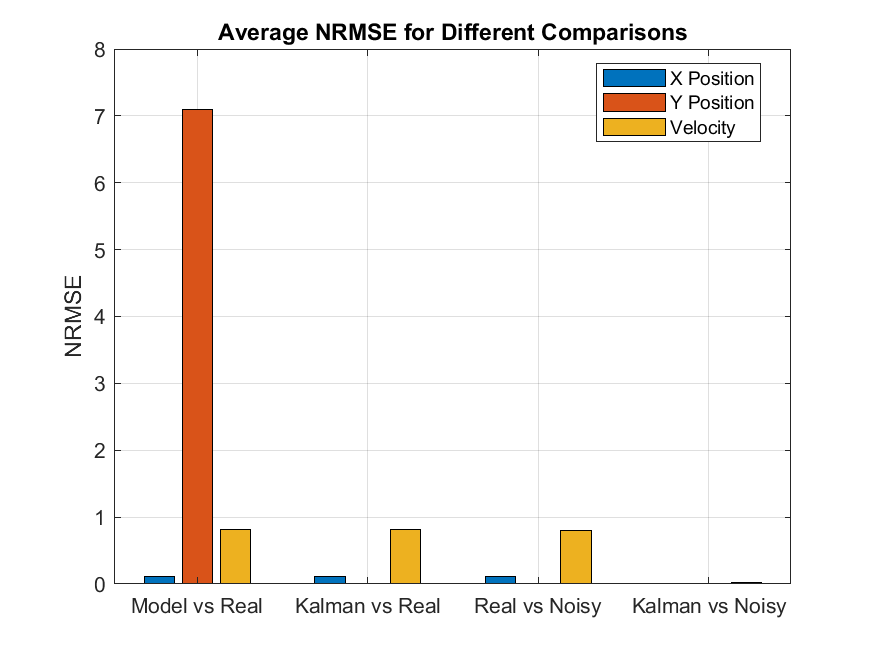
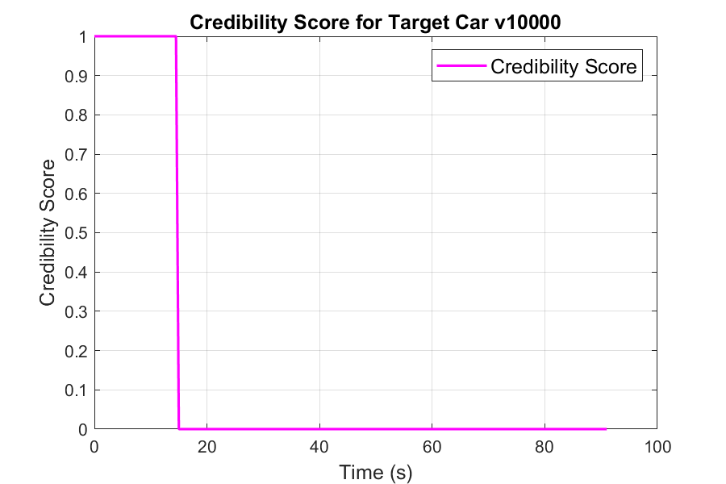
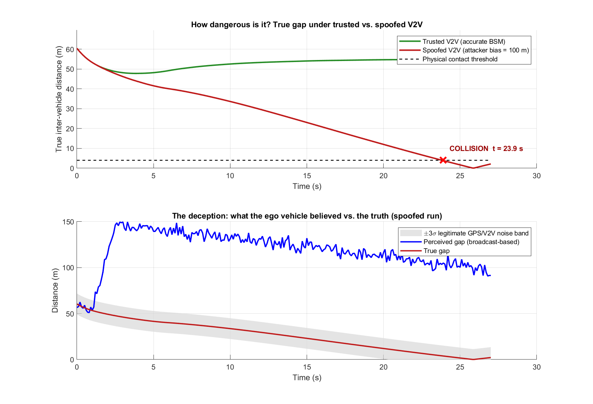

# Noise-Affected Traffic Simulation Using Kalman Filtering

A MATLAB multi-lane highway simulation that asks: **how much should a connected vehicle trust the V2V
data it receives?**

Vehicles exchange position and velocity over V2V, and those messages are corrupted by sensor or GPS noise
and, in the worst case, by deliberate spoofing. Each vehicle runs a **Kalman filter** on the data it
receives from its neighbours, rates how **credible** each neighbour is, and uses a **chi-squared gated KF**
to reject measurements that are statistically implausible.



---

## What's inside

* **Multi-lane traffic with on-ramp merging:** vehicles follow an IDM-based car-following and
  lane-change model (`IDM4LC.m`, `IDM4LCN.m`).
* **Three V2V noise scenarios:** no noise, constant noise, and a realistic noise profile that switches
  between accurate and noisy periods over time.
* **Kalman filter state estimation:** each vehicle filters the received position (x, y) and velocity
  of the vehicles it tracks.
* **Credibility and trustworthiness score:** a sliding-window error measure on x, y and v is combined into
  one credibility score, and a neighbour counts as trustworthy above a threshold.
* **Chi-squared gated KF (security):** a Mahalanobis/NIS innovation gate (γ = 5.991, 95%) rejects spoofed
  measurements, so the filter stays on the true trajectory during an attack.
* **Attack demo:** a cooperative merging scenario with trusted vs. spoofed V2V messages (BSM/GPS bias)
  shows how a spoofed position can cause a collision.

| Clean V2V | Noisy V2V |
|---|---|
|  |  |



## Repository structure

```
main/       main.m / main_noise.m (multi-lane simulation), attack_demo.m (V2V spoofing demo)
function/   Car.m (vehicle + KF + gated KF + credibility), IDM models, plotting, SecurityPlot.m
test_/      Standalone KF and credibility-rating experiments on simple models
data/       Saved results (.mat), figures and simulation videos
```

## How to run

Requirements: MATLAB, plus the Statistics and Machine Learning Toolbox for `chi2inv`. Without it, the
code falls back to a hard-coded threshold.

```matlab
cd main
attack_demo        % self-contained: writes the video and figure to main/output/merging_attack_demo/
main_noise         % full multi-lane simulation with noisy V2V
```

`main.m` and `main_noise.m` use absolute `addpath` and output paths from my machine, so change them to
your clone location first.
